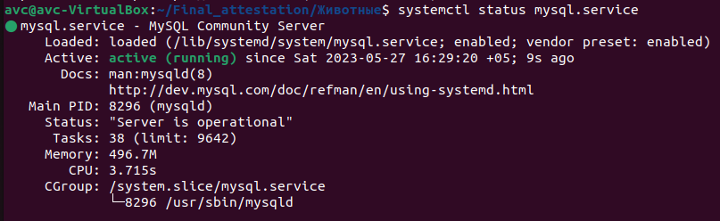
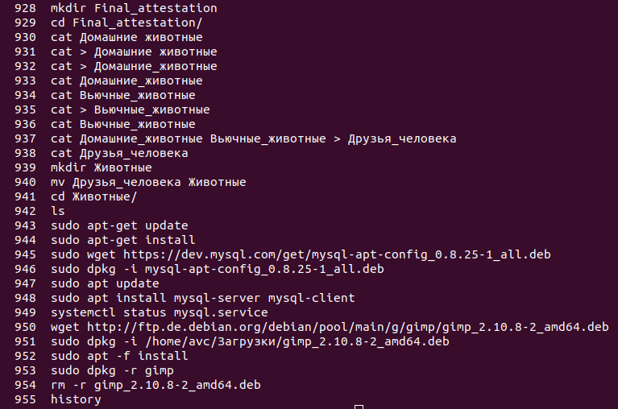
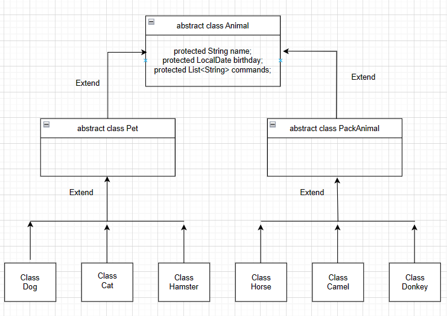
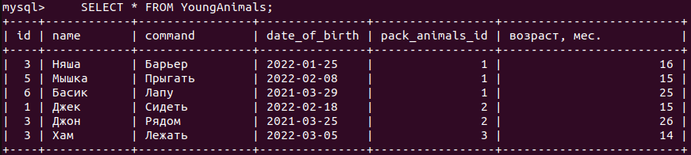

1. Используя команду cat в терминале операционной системы Linux, создать
два файла Домашние животные (заполнив файл собаками, кошками,
хомяками) и Вьючные животными (заполнив файл Лошадьми, верблюдами и
ослы), а затем объединить их. Просмотреть содержимое созданного файла.

Переименовать файл, дав ему новое имя (Друзья человека).

    cat > Домашние_животные

    собаки

    кошки

    хомяки

    ^C

    cat > Вьючные_животные

    лошади

    верблюды

    ослы

    ^C

    cat Друзья_человека 

    собаки

    кошки

    хомяки

    лошади

    верблюды

    ослы

2. Создать директорию, переместить файл туда.

Содаем директорию:

    mkdir Животные

    mv Друзья_человека Животные

    cd Животные/

    ls

    Друзья_человека

   
3. Подключить дополнительный репозиторий MySQL. Установить любой пакет из этого репозитория.

Устанавливаем:

    sudo wget https://dev.mysql.com/get/mysql-apt-config_0.8.25-1_all.deb

    sudo dpkg -i mysql-apt-config_0.8.25-1_all.deb

    sudo apt update

    sudo apt install mysql-server mysql-client

    systemctl status mysql.service

4. Установить и удалить deb-пакет с помощью dpkg.

Устанавливаем:

    wget http://ftp.de.debian.org/debian/pool/main/g/gimp/gimp_2.10.8-2_amd64.deb

    sudo dpkg -i /home/avc/Загрузки/gimp_2.10.8-2_amd64.deb

    sudo apt -f install

Удаляем:

    sudo dpkg -r gimp

    rm -r gimp_2.10.8-2_amd64.deb

5. Выложить историю команд в терминале ubuntu

История в Ubuntu - команда:

    history

6. Нарисовать диаграмму, в которой есть класс родительский класс, домашние животные и вьючные животные, в составы которых в случае домашних животных войдут классы: собаки, кошки, хомяки, а в класс вьючные животные войдут: Лошади, верблюды и ослы.

7. В подключенном MySQL репозитории создать базу данных “Друзья человека”  

    sudo su

    mysql

    mysql> CREATE DATABASE IF NOT EXISTS HumanFriends;

    mysql> USE HumanFriends;

8. Создать таблицы с иерархией из диаграммы в БД

    CREATE TABLE pets

    (	
        
        id INT NOT NULL PRIMARY KEY AUTO_INCREMENT,
        class_of_pet VARCHAR(45)
    );

    INSERT INTO pets(class_of_pet)

    VALUES

        ("cats"),
        ("dogs"),
        ("hamsters");        
    SELECT * FROM pets;

CREATE TABLE pack_animals

(	

	id INT NOT NULL PRIMARY KEY AUTO_INCREMENT,
    class_of_pack_animals VARCHAR(45)
);

INSERT INTO pack_animals(class_of_pack_animals)

VALUES

	("horses"),
    ("camels"),
    ("donkeys");    
SELECT * FROM pack_animals;

9. Заполнить низкоуровневые таблицы именами(животных), командами которые они выполняют и датами рождения.

DROP TABLE IF EXISTS horses;
CREATE TABLE horses

(	

	id INT NOT NULL PRIMARY KEY AUTO_INCREMENT,
    name VARCHAR(45) NOT NULL,
    command VARCHAR(45),
    date_of_birth DATE NOT NULL,
    animals_id INT NOT NULL
);

INSERT INTO horses(name, command, date_of_birth, animals_id)

VALUES

	("Белый", "Галоп", "2015-11-25", 1.1),
    ("Крутой", "Аллюр", "2017-05-07", 1.2),
    ("Няша", "Барьер", "2022-01-25", 1.3);    
SELECT * FROM horses;

DROP TABLE IF EXISTS camels;

CREATE TABLE camels

(	

	id INT NOT NULL PRIMARY KEY AUTO_INCREMENT,
    name VARCHAR(45) NOT NULL,
    command VARCHAR(45),
    date_of_birth DATE NOT NULL,
    animals_id INT NOT NULL
);

INSERT INTO camels(name, command, date_of_birth, animals_id)

VALUES

	("Бом", "Стоять", "2020-11-25", 2.1),
    ("Бим", "Сидеть", "2018-05-17", 2.2),
    ("Бен", "Лежать", "2012-03-17", 2.3);    
SELECT * FROM camels;

DROP TABLE IF EXISTS donkeys;

CREATE TABLE donkeys

(	

	id INT NOT NULL PRIMARY KEY AUTO_INCREMENT,
    name VARCHAR(45) NOT NULL,
    command VARCHAR(45),
    date_of_birth DATE NOT NULL,
    animals_id INT NOT NULL
);

INSERT INTO donkeys(name, command, date_of_birth, animals_id)

VALUES

	("Олик", "Везти", "2022-09-28", 3.1),
    ("Омик", "Идти", "2019-07-08", 3.2),
    ("Осик", "Стоять", "2015-03-22", 3.3);
    
SELECT * FROM donkeys;

DROP TABLE IF EXISTS cats;

CREATE TABLE cats

(	

	id INT NOT NULL PRIMARY KEY AUTO_INCREMENT,
    name VARCHAR(45) NOT NULL,
    command VARCHAR(45),
    date_of_birth DATE NOT NULL,
    animals_id INT NOT NULL
);

INSERT INTO cats(name, command, date_of_birth, animals_id)

VALUES

	("Киса", "Лежать", "2023-01-08", 4.1),
    ("Мышка", "Прыгать", "2022-02-08", 4.2),
    ("Басик", "Лапу", "2021-03-29", 4.3);
    
SELECT * FROM cats;

DROP TABLE IF EXISTS dogs;

CREATE TABLE dogs

(	

	id INT NOT NULL PRIMARY KEY AUTO_INCREMENT,
    name VARCHAR(45) NOT NULL,
    command VARCHAR(45),
    date_of_birth DATE NOT NULL,
    animals_id INT NOT NULL
);

INSERT INTO dogs(name, command, date_of_birth, animals_id)

VALUES

	("Джек", "Сидеть", "2022-02-18", 5.1),
    ("Джим", "Голос", "2010-08-29", 5.2),
    ("Джон", "Рядом", "2021-03-25", 5.3);
    
SELECT * FROM dogs;

DROP TABLE IF EXISTS hamster;

CREATE TABLE hamster

(	

	id INT NOT NULL PRIMARY KEY AUTO_INCREMENT,
    name VARCHAR(45) NOT NULL,
    command VARCHAR(45),
    date_of_birth DATE NOT NULL,
    pack_animals_id INT NOT NULL
);

INSERT INTO hamster(name, command, date_of_birth, animals_id)

VALUES

	("Хом", "Спать", "2020-02-12", 6.1),
    ("Хим", "Есть", "2011-05-05", 6.2),
    ("Хам", "Лежать", "2022-03-05", 6.3);    
SELECT * FROM hamster;

10. Удалив из таблицы верблюдов, т.к. верблюдов решили перевезти в другой питомник на зимовку. Объединить таблицы лошади, и ослы в одну таблицу.

Решение:

    DELETE FROM pack_animals
    WHERE class_of_pack_animals="camels";

    SELECT * FROM pack_animals;

    DROP TABLE camels;

    CREATE TABLE horses_donkeys 
    SELECT * FROM horses 
    UNION ALL SELECT * FROM donkeys;

    SELECT * FROM horses_donkeys;

11. Создать новую таблицу “молодые животные” в которую попадут все животные старше 1 года, но младше 3 лет и в отдельном столбце с точностью до месяца подсчитать возраст животных в новой таблице.

Решение:

    DROP TABLE IF EXISTS YoungAnimals;
    CREATE TABLE YoungAnimals AS
    SELECT *,  TIMESTAMPDIFF(MONTH, date_of_birth, CURDATE()) AS "возраст, мес." 
    FROM horses 
    WHERE (TIMESTAMPDIFF(MONTH, date_of_birth, CURDATE()) > 12 AND (TIMESTAMPDIFF(MONTH, date_of_birth, CURDATE())) < 36)
    UNION ALL 
    SELECT *,  TIMESTAMPDIFF(MONTH, date_of_birth, CURDATE()) AS "возраст, мес."
    FROM donkeys
    WHERE (TIMESTAMPDIFF(MONTH, date_of_birth, CURDATE()) > 12 AND (TIMESTAMPDIFF(MONTH, date_of_birth, CURDATE())) < 36)
    UNION ALL 
    SELECT *,  TIMESTAMPDIFF(MONTH, date_of_birth, CURDATE()) AS "возраст, мес."
    FROM cats
    WHERE (TIMESTAMPDIFF(MONTH, date_of_birth, CURDATE()) > 12 AND (TIMESTAMPDIFF(MONTH, date_of_birth, CURDATE())) < 36)
    UNION ALL 
    SELECT *,  TIMESTAMPDIFF(MONTH, date_of_birth, CURDATE()) AS "возраст, мес."
    FROM dogs
    WHERE (TIMESTAMPDIFF(MONTH, date_of_birth, CURDATE()) > 12 AND (TIMESTAMPDIFF(MONTH, date_of_birth, CURDATE())) < 36)
    UNION ALL 
    SELECT *,  TIMESTAMPDIFF(MONTH, date_of_birth, CURDATE()) AS "возраст, мес."
    FROM hamster
    WHERE (TIMESTAMPDIFF(MONTH, date_of_birth, CURDATE()) > 12 AND (TIMESTAMPDIFF(MONTH, date_of_birth, CURDATE())) < 36);    

    SELECT * FROM YoungAnimals;

12. Объединить все таблицы в одну, при этом сохраняя поля, указывающие на прошлую принадлежность к старым таблицам.

Решение

    DROP TABLE IF EXISTS NewAnimals;
    CREATE TABLE NewAnimals AS
    SELECT *, "horses" AS "из какой таблицы"
    FROM horses
    UNION ALL
    SELECT *, "donkeys" AS "из какой таблицы"
    FROM donkeys
    UNION ALL    
    SELECT *, "cats" AS "из какой таблицы"
    FROM cats
    UNION ALL
    SELECT *, "dogs" AS "из какой таблицы"
    FROM dogs
    UNION ALL
    SELECT *, "hamster" AS "из какой таблицы"
    FROM hamster;

    SELECT * FROM NewAnimals;